# End-to-End Request Flow Sequence Diagram

## Multi-Agent EM Roadmap Platform - `/learn` Endpoint Flow

```mermaid
sequenceDiagram
    participant Client as HTTP Client
    participant FastAPI as FastAPI Server
    participant Cache as Redis Cache
    participant Coordinator as CoordinatorAgent
    participant Broker as MessageBroker
    participant TopicAgent as TopicBreakdownAgent
    participant ResearchAgent as ResearchAgent
    participant HTMLAgent as HTMLGenerationAgent
    participant VectorDB as ChromaDB
    participant OpenAI as OpenAI API
    participant Observability as OpenTelemetry

    %% Request Initialization
    Client->>FastAPI: GET /learn?topic="Deep Learning"
    FastAPI->>FastAPI: validate_topic(topic)
    FastAPI->>Cache: get_cached_response(cache_key)
    
    alt Cache Hit
        Cache-->>FastAPI: cached_result
        FastAPI-->>Client: cached_result
    else Cache Miss
        Cache-->>FastAPI: null
        FastAPI->>Observability: start_span("learn_request")
        FastAPI->>Coordinator: process_task(workflow_data)
        
        %% Workflow Orchestration
        Coordinator->>Observability: start_span("workflow_execution")
        Coordinator->>Coordinator: create_workflow(workflow_id)
        Coordinator->>Broker: broadcast(workflow_started)
        
        %% Step 0: Topic Breakdown
        Coordinator->>Observability: start_span("step_0_topic_breakdown")
        Coordinator->>Coordinator: _is_agent_available("topic_breakdown_agent")
        Coordinator->>Broker: send_request(topic_breakdown_agent, task_data)
        
        Broker->>TopicAgent: deliver_message(REQUEST)
        TopicAgent->>Observability: start_span("process_task")
        TopicAgent->>OpenAI: create_completion(topic breakdown)
        OpenAI-->>TopicAgent: subtopics_response
        TopicAgent->>VectorDB: search_similar_content(topic)
        VectorDB-->>TopicAgent: related_content
        TopicAgent->>TopicAgent: generate_subtopics_with_context()
        TopicAgent->>Broker: send_response(coordinator, result)
        Broker-->>Coordinator: step_result
        
        alt Step Success
            Coordinator->>Coordinator: update_workflow_context(step_result)
            Coordinator->>Observability: record_step_success()
        else Step Failure
            Coordinator->>Coordinator: handle_step_failure()
            Coordinator->>Broker: broadcast(workflow_failed)
            Coordinator-->>FastAPI: error_response
            FastAPI-->>Client: 500 Internal Server Error
        end
        
        %% Step 1: Research
        Coordinator->>Observability: start_span("step_1_research")
        Coordinator->>Broker: send_request(research_agent, task_data)
        
        Broker->>ResearchAgent: deliver_message(REQUEST)
        ResearchAgent->>Observability: start_span("process_task")
        ResearchAgent->>VectorDB: search_similar_content(subtopics)
        VectorDB-->>ResearchAgent: research_content
        ResearchAgent->>OpenAI: create_completion(research synthesis)
        OpenAI-->>ResearchAgent: research_response
        ResearchAgent->>Broker: send_response(coordinator, result)
        Broker-->>Coordinator: step_result
        
        alt Step Success
            Coordinator->>Coordinator: update_workflow_context(step_result)
            Coordinator->>Observability: record_step_success()
        else Step Failure
            Coordinator->>Coordinator: handle_step_failure()
            Coordinator->>Broker: broadcast(workflow_failed)
            Coordinator-->>FastAPI: error_response
            FastAPI-->>Client: 500 Internal Server Error
        end
        
        %% Step 2: HTML Generation
        Coordinator->>Observability: start_span("step_2_html_generation")
        Coordinator->>Broker: send_request(html_generation_agent, task_data)
        
        Broker->>HTMLAgent: deliver_message(REQUEST)
        HTMLAgent->>Observability: start_span("process_task")
        HTMLAgent->>OpenAI: create_completion(html content)
        OpenAI-->>HTMLAgent: html_response
        HTMLAgent->>HTMLAgent: generate_html_content()
        HTMLAgent->>Broker: send_response(coordinator, result)
        Broker-->>Coordinator: step_result
        
        alt Step Success
            Coordinator->>Coordinator: update_workflow_context(step_result)
            Coordinator->>Observability: record_step_success()
        else Step Failure
            Coordinator->>Coordinator: handle_step_failure()
            Coordinator->>Broker: broadcast(workflow_failed)
            Coordinator-->>FastAPI: error_response
            FastAPI-->>Client: 500 Internal Server Error
        end
        
        %% Workflow Completion
        Coordinator->>Observability: start_span("workflow_completion")
        Coordinator->>Coordinator: mark_workflow_completed()
        Coordinator->>Broker: broadcast(workflow_completed)
        Coordinator-->>FastAPI: workflow_result
        FastAPI->>Cache: cache_response(cache_key, result, ttl=3600)
        FastAPI->>Observability: end_span("learn_request")
        FastAPI-->>Client: 200 OK with generated content
    end
    
    %% Background Processes
    Note over Broker: Continuous message processing loops
    loop Every 100ms
        Broker->>Broker: process_pending_messages()
        Broker->>Broker: check_timeouts()
    end
    
    Note over Observability: Continuous metrics collection
    loop Every 30 seconds
        Observability->>Observability: export_metrics()
        Observability->>Observability: sample_traces()
    end
    
    %% Error Handling Flow
    Note over Coordinator, Broker: Async error handling
    alt Agent Timeout
        Broker->>Coordinator: timeout_error
        Coordinator->>Coordinator: handle_timeout()
        Coordinator->>Broker: broadcast(step_failed)
    else Agent Unavailable
        Coordinator->>Coordinator: agent_unavailable_error
        Coordinator->>Broker: broadcast(workflow_failed)
    end
```



## Detailed Component Interactions

### 1. **Request Entry Point**
```
Client → FastAPI → Cache Check → Workflow Orchestration
```

### 2. **Workflow Execution**
```
Coordinator → MessageBroker → Individual Agents → Response Aggregation
```

### 3. **Agent Processing**
```
Agent → VectorDB Search → OpenAI API → Result Processing → Response
```

### 4. **Data Flow**
```
Topic → Subtopics → Research → HTML Generation → Final Content
```

### 5. **Observability & Monitoring**
```
All Components → OpenTelemetry → Metrics/Traces → Monitoring Dashboard
```

## Key Flow Characteristics

### **Async Communication**
- All agent communication uses async message passing
- MessageBroker handles request/response correlation
- Timeout management for each step

### **Context Propagation**
- Workflow context passed between steps
- Previous step results inform next step
- VectorDB provides contextual content

### **Error Handling**
- Step-level error handling with rollback
- Workflow failure broadcasting
- Graceful degradation options

### **Performance Optimizations**
- Redis caching for repeated requests
- Parallel processing where possible
- Connection pooling for external APIs

### **Observability**
- Distributed tracing across all components
- Metrics collection and export
- Real-time monitoring capabilities

## Message Types

1. **REQUEST**: Agent task requests
2. **RESPONSE**: Agent task responses  
3. **NOTIFICATION**: Workflow events (start/complete/failed)
4. **HEARTBEAT**: Agent health checks

## Data Stores

1. **Redis Cache**: Request/response caching
2. **ChromaDB**: Vector embeddings and semantic search
3. **File System**: Generated HTML content persistence

## External Dependencies

1. **OpenAI API**: Content generation and embeddings
2. **OpenTelemetry**: Observability and monitoring
3. **FastAPI**: Web framework and routing

This sequence diagram represents the complete end-to-end flow from client request to response, including all major system interactions, error handling paths, and background processes.
